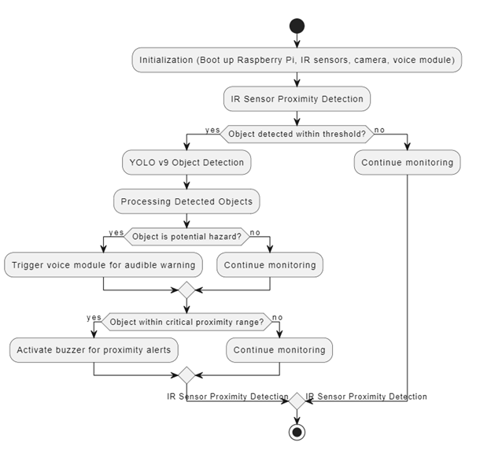
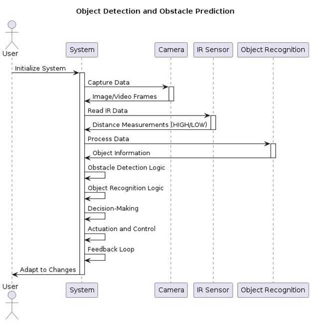

# Ishare: Smart Cane for the Visually Impaired

## Abstract
The "Ishare" project intends to create a working prototype of a smart cane to help blind people safely and freely navigate their environment. The smart cane uses YOLOv9 for object identification, IR sensors, a buzzer, and Raspberry Pi 4 (RPi 4) for obstacle detection to give the user real-time information about objects and obstacles in their path.

The main goals of the research are:
- To apply IR sensors for proximity detection in order to detect barriers.
- To use the YOLOv9 model for advanced object recognition.

The central processing unit is the RPi 4, which gathers data from sensors and processes it to provide the user with feedback signals. Essential components include:
- **IR sensors** for proximity detection.
- **Camera module** for recording live video feeds.
- **Speaker/Buzzer** for giving the user haptic and auditory feedback.

The system architecture is made up of interconnected modules that handle human interface, processing, and sensor data collection. The RPi's user-friendly interface allows customization of settings such as feedback preferences and sensitivity.

In practical use, the smart cane keeps an eye on the user's surroundings, identifying and categorizing obstacles through the processing of a live video stream by the YOLOv9 model. Haptic vibrations and audible alerts provide the user with real-time feedback, improving their awareness and safety while navigating.

This project has the potential to significantly enhance the mobility and independence of people with visual impairments by addressing the challenges they face in dynamic environments. Future improvements will include enhancing object identification capabilities, integrating GPS features, and optimizing battery life for extended use.

To sum up, the "Ishare" smart cane project is an innovative application of technology to promote inclusivity and accessibility for individuals with visual impairments. Through the use of IR sensors, advanced object recognition algorithms, and the RPi 4, this project seeks to make a meaningful difference in their lives.

---

## Features
- **YOLOv9 Object Detection**: Real-time detection and identification of objects and potential hazards.
- **IR Proximity Sensors**: Detect obstacles within a predefined range.
- **Auditory and Haptic Feedback**: Alerts users through a buzzer and voice module.
- **Customizable Settings**: Adjust feedback preferences and sensitivity via the RPi interface.
- **Real-Time Monitoring**: Processes live video streams for immediate obstacle recognition.

---

## System Architecture
### Flowchart

The flowchart outlines the operational process of the Ishare smart cane:
1. Initialization of the system (RPi, IR sensors, camera, and voice module).
2. IR proximity detection to check for objects within the threshold.
3. YOLOv9 for advanced object detection and categorization.
4. Triggering feedback mechanisms based on object proximity and potential hazard assessment.

### Sequence Diagram

The sequence diagram illustrates the interactions between system components (Camera, IR Sensor, Object Recognition module, and the user) to capture data, process it, and provide feedback for obstacle prediction and navigation.

---

## Components Used
- **Raspberry Pi 4**: Central processing unit for data collection and processing.
- **YOLOv9**: Advanced object detection model.
- **IR Sensors**: For proximity detection.
- **Camera Module**: Captures live video feed for object recognition.
- **Buzzer and Voice Module**: Provides auditory and haptic feedback.

---

## Project Video
[Watch the Project video on YouTube](https://youtu.be/FP8hflIMdJw)

---

## How to Use
1. **Hardware Setup**:
   - Connect the IR sensors, camera module, buzzer, and voice module to the Raspberry Pi.
   - Ensure all components are properly powered and configured.

2. **Software Installation**:
   - Install the YOLOv9 model and required Python libraries on the RPi.
   - Configure the proximity detection thresholds and feedback preferences.

3. **Operation**:
   - Power on the smart cane.
   - The system will initialize and start monitoring the surroundings.
   - Feedback (auditory and haptic) will be triggered based on obstacle detection and recognition.

---

## Future Enhancements
- Integration of GPS for navigation assistance.
- Improved object detection capabilities with optimized YOLOv9.
- Extended battery life for prolonged usage.
- Enhanced haptic feedback mechanisms.
